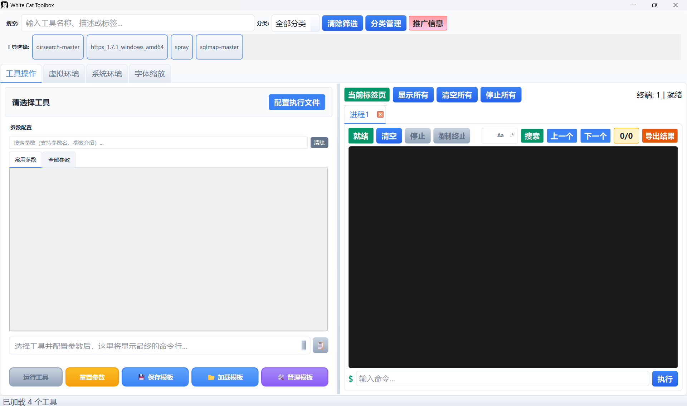
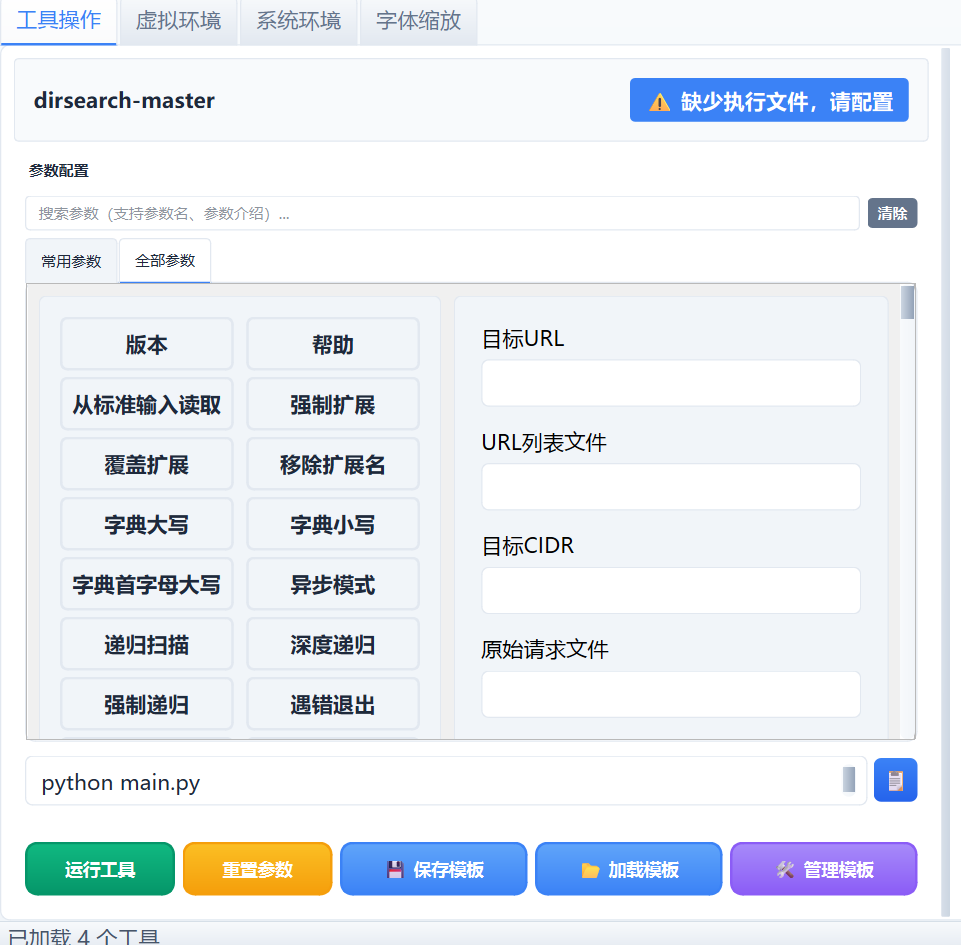
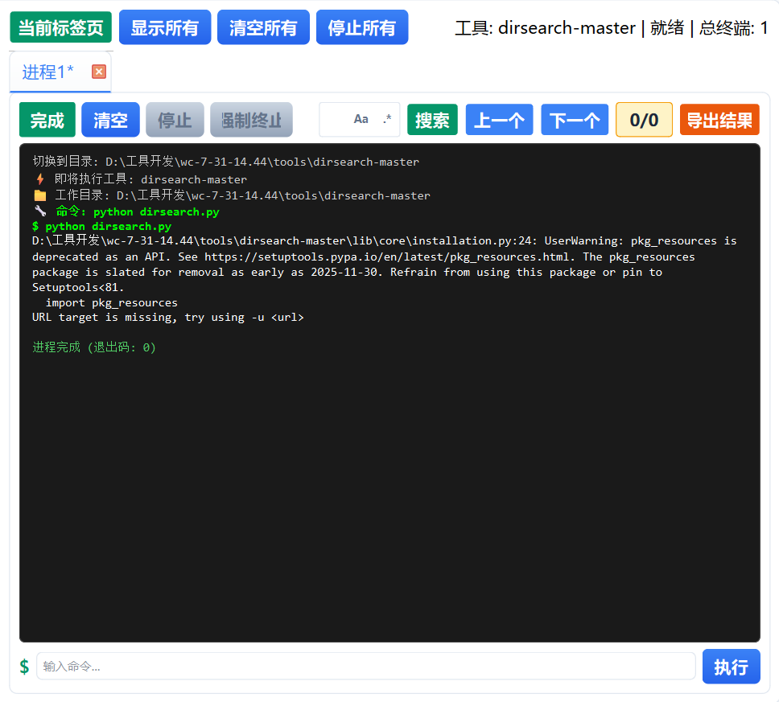
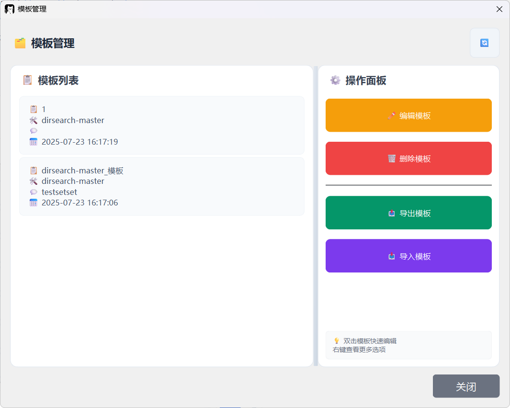

# 🐱 WhiteCat Toolbox - 白猫工具箱

<div align="center">


[](https://github.com/whitecattoolbox/releases)
[](https://www.python.org/)
[](https://github.com/whitecattoolbox)
[](LICENSE)

*一款专为CLI（命令行）工具设计的集成图形化工具管理平台*

[简体中文](#) | [English](README_EN.md)

---

## 📋 目录

- [🌟 项目简介](#-项目简介)
- [✨ 核心特性](#-核心特性)
- [🎯 功能详解](#-功能详解)
- [🚀 快速开始](#-快速开始)
- [📸 界面展示](#-界面展示)
- [🛠️ 工具集成](#️-工具集成)
- [🤖 配置教程](#-配置教程)
- [🔌 适配项目](#-适配项目)
- [🔧 配置说明](#-配置说明)
- [📦 开发指南](#-开发指南)
- [🗓️ 开发计划](#️-开发计划)
- [🤝 贡献指南](#-贡献指南)
- [💖 赞助支持](#-赞助支持)
- [📝 更新日志](#-更新日志)
- [📄 开源协议](#-开源协议)

---

## 🌟 项目简介

WhiteCat Toolbox（白猫工具箱）是一款现代化的命令行工具集成图形化管理平台，旨在为专业人员和初学者提供统一、高效的工具管理和使用体验。通过优雅的图形界面和智能的环境管理，让复杂的命令行工具变得简单易用。

### 为什么选择 WhiteCat Toolbox？

- 🎨 **现代化界面**：基于 PySide6 (Qt) 构建的美观界面
- 🔌 **即插即用**：简单的配置文件即可集成新工具，无需修改代码
- 🌍 **跨平台支持**：完美支持 Windows、Linux 和 macOS
- 🐍 **智能环境管理**：自动隔离 Python 环境，避免依赖冲突
- 🚀 **高效工作流**：参数模板、批量执行、历史记录、多进程运行等提升效率

### WhiteCat Toolbox的核心价值是什么？

- **学习成本降低**：可视化的图形操作和悬浮弹窗介绍参数信息将带来简单易懂的功能介绍，不再需要到help信息里一点一点查询
- **工作效率提升**：强大的模版化操作可将固定流程快速应用；按工具分类展示的多进程标签页允许您在一个工具下运行多个相同程序或不同参数，增加的运行结束提示功能将让您及时知晓进度

- **环境配置统一**：支持单独Python解释器选择、Python虚拟环境选择、自定义环境变量，使得您可以在一个页面下使用多种不同的环境运行，更加轻松便捷；同时**能够快速切换Python版本来进行测试，为开发提供助力！**

### WhiteCat Toolbox的发展需要大家的支持

- **本项目仅提供内测版和公测版，但不提供付费版，这意味着您无需任何费用即可使用！**
- **仅接受开源赞助打赏与企业赞助商赞助用以维持项目运转维护**，皆为自愿原则，项目不会以任何方式强制付费！
- 内测版用于测试新功能BUG，采取邀请制和开源赞助邀请制，在确认无明显BUG之后会转为公测版，因此您无需纠结是否要参与内测，这与您实际体验并无强制关联，仅适合希望第一时间体验新功能和反馈的玩家。
- **在此诚邀各大开发者能根据配置文件教程，在项目内预置并提交PR到本项目中**，为用户提供最便捷的操作体验，并会在本项目推广页面互相推荐，互惠互利。

---

## ✨ 核心特性

### 🎯 工具管理
- **统一界面**：所有工具在同一界面管理，无需切换窗口
- **动态加载**：自动扫描并加载工具目录中的所有配置
- **灵活配置**：通过简单的文本配置文件定义工具参数
- **多进程支持**：同时运行多个工具实例，互不干扰

### 🌈 用户体验
- **多语言支持**：内置中英文界面，可扩展其他语言
- **界面缩放**：6级缩放模式，从紧凑到超大，适应不同显示器
- **智能搜索**：支持模糊/精确/正则三种搜索模式
- **拖拽排序**：参数可自由拖拽调整顺序

### 🔧 参数管理
- **参数分组**：常用参数和全部参数分离，提高效率
- **参数类型**：支持复选框（勾选项）和文本框（输入项）
- **必填验证**：自动检查必填参数，防止遗漏
- **参数模板**：保存常用参数组合，一键应用

### 🐍 环境隔离
- **Python环境管理**：每个工具独立的Python环境
- **自动检测**：智能检测系统Python和虚拟环境
- **依赖隔离**：避免不同工具的依赖冲突
- **Python解释器**：快速选择不同版本的Python用于测试

### 📊 进程监控
- **实时输出**：彩色显示工具输出，支持ANSI转义序列
- **多标签页**：每个进程独立标签页，可同时查看多个输出
- **状态显示**：实时显示进程运行状态
- **结束检测**：运行完成界面提示
- **历史记录**：保存命令历史，方便重复执行

### 🔄 自动更新
- **版本检查**：启动时自动检查新版本
- **GitHub集成**：通过GitHub API获取最新版本

---

## 🎯 功能详解

### 1. 工具操作界面

工具操作界面分为两个主要区域：

**左侧参数配置区**：
- 📝 参数编辑：直观的参数输入界面
- 🔍 智能搜索：快速定位需要的参数
- 📋 参数模板：保存和应用常用配置
- ✅ 必填验证：确保关键参数不遗漏

**右侧运行监控区**：
- 🖥️ 终端输出：彩色显示命令执行结果
- 📑 多进程标签：同时运行和监控多个实例
- 🔄 环境管理：配置独立的执行环境
- 📊 系统日志：查看详细的执行日志

### 2. 参数配置系统

**参数类型**：
- **勾选项**：用于开关类参数（如 --verbose, --debug）
- **输入项**：用于需要值的参数（如 --url, --output）

**参数属性**：
- **参数名**：实际传递给工具的参数
- **显示名**：在界面上显示的易读名称
- **描述信息**：参数的详细说明
- **必填标记**：标识必须填写的参数

**高级功能**：
- **拖拽排序**：按使用频率调整参数顺序
- **右键菜单**：快速清空、复制参数
- **批量操作**：一键清空所有参数
- **参数组合**：将多个参数保存为模板

### 3. 环境管理器

**功能特性**：
- 🔍 **自动检测**：扫描系统中的Python安装
- 🎯 **手动指定**：选择特定的Python解释器
- 📦 **虚拟环境**：支持venv和conda环境
- 🔧 **环境配置**：为每个工具配置独立环境

**使用场景**：
- 工具依赖特定Python版本
- 避免全局安装污染系统
- 不同工具依赖冲突隔离
- 测试不同环境下的工具表现

### 4. 模板系统

**模板功能**：
- 💾 **保存模板**：将当前参数保存为模板
- 📂 **应用模板**：一键应用已保存的配置
- ✏️ **编辑模板**：修改模板名称和备注
- 📤 **导入导出**：分享模板配置

**使用示例**：
- SQL注入测试模板
- 目录扫描常用配置
- 不同目标的定制参数
- 团队共享的标准配置

### 5. 推广系统

**推广页面**：
- 📢 **项目推荐**：展示优秀的安全项目
- 🏆 **赞助排行**：感谢支持项目的用户
- 📜 **赞助历史**：记录所有赞助信息

---

## 🚀 快速开始

### 系统要求

- Python 3.11
- PySide6 (Qt for Python)
- 支持的操作系统：Windows 10+, Linux, macOS

### 安装步骤

#### 源码部署

1. **克隆仓库**
```bash
git clone https://github.com/yourusername/WhiteCatToolbox.git
cd WhiteCatToolbox
```

2. **安装依赖**
```bash
pip install -r requirements.txt
```

3. **运行程序**
```bash
python main.py
```

#### 执行文件

1、下载系统对应的可执行文件

```
https://github.com/honmashironeko/WhiteCatToolbox/releases
```

### 添加新工具

1. 在 `tools` 目录下创建工具文件夹
2. 添加工具文件和 `wct_config.txt` 配置文件
3. 重启程序，新工具将自动加载

---

## 📸 界面展示

### 主界面


*现代化的主题界面，左侧工具列表，右侧操作区域*

### 参数配置


*直观的参数配置界面，支持搜索和拖拽排序*

### 运行监控


*实时彩色输出，多进程标签页管理*

### 模板管理


*保存和应用参数模板，提高工作效率*

---

## 🛠️ 工具集成

### 集成新工具

创建 `tools/your_tool/wct_config.txt`：

```ini
%常用参数

%%勾选项
-v=详细模式=显示详细输出信息=0
--debug=调试模式=启用调试日志=0

%%输入项
-u=目标URL=要扫描的目标地址=1
-o=输出文件=结果保存路径=0

%全部参数

%%勾选项
--random-agent=随机UA=使用随机User-Agent=0
--tor=使用Tor=通过Tor网络发送请求=0

%%输入项
--threads=线程数=并发线程数量=0
--timeout=超时时间=请求超时秒数=0
```

### 配置文件格式

- `%分组名` - 定义参数分组
- `%%勾选项` - 后续为复选框类型参数
- `%%输入项` - 后续为文本输入类型参数
- `参数名=显示名=描述=是否必填(0/1)`

---

## 🤖 配置教程

为了简化配置文件的创建过程，WhiteCat Toolbox 提供了AI辅助生成功能。通过使用项目内置的提示词模板，您可以快速将任何命令行工具的帮助信息转换为标准的配置文件格式。

### 💡 使用场景

- ✅ 快速集成新的命令行工具
- ✅ 减少手动编写配置文件的工作量
- ✅ 确保配置文件格式的标准化和准确性
- ✅ 处理复杂工具的大量参数

### 📝 准备工作

1. **获取工具的帮助信息**
   ```bash
   # 常见的获取帮助信息的方式
   tool_name --help
   tool_name -h
   tool_name help
   python tool_name.py --help
   ```

2. **复制帮助文本**
   将完整的帮助输出复制到剪贴板中

### 🚀 使用AI生成配置文件

#### 步骤1：准备提示词

项目根目录下的 `prompt.txt` 文件包含了专门设计的AI提示词模板：

````
你是一个高度智能的文本分析和格式化机器人。你的任务是严格按照以下规则，对我提供的命令行帮助文本进行分析、分类、翻译和格式化。

核心任务:

你需要猜测每一个命令行参数的交互类型，并将其归入以下两类之一：%%勾选项、%%输入项。

**分类定义:**

1. `%%勾选项`: 用于表示一个开关或标志，它本身不需要附带值。通常用于启用或禁用某个功能。 (例如: `--batch`, `--beep`, `--help`)
2. `%%输入项`: 用于需要用户提供一个具体值的参数。这个值可以是字符串、数字、文件路径等。

**输出规则:**

1. 在最终输出内容的最顶端，必须独占一行地包含 `%全部参数`。
2. 对于每一个参数，首先将参数分组归类到相应的标题 (`%%勾选项` 或 `%%输入项`) 。
3. 在分类标题的下一行，输出经过处理和翻译的内容。
4. **参数处理**: 在输出参数时，必须清理原始参数字符串：移除所有大写形式的占位符 (如 `URL`, `REQUESTFILE`, `COOKIE`) 以及占位符前的 `=` 或空格。
   - 例如：`-r REQUESTFILE` 处理为 `-r`。
   - 例如：`--cookie=COOKIE` 处理为 `--cookie`。
   - 例如：`-u URL, --url=URL` 处理为 `-u`。
5. **内容格式**: 格式为 `处理后的原参数`=`参数中文名`=`参数中文介绍`=`0`。**注意：每一行的末尾都必须以 `=0` 结尾。**

**输出格式示例:**

```
%全部参数
%%勾选项
--batch=批处理=从不询问用户输入，使用默认行为=0
--version=版本=显示程序版本号并退出=0
--random-agent=随机UA=使用随机选择的用户代理（User-Agent）=0

%%输入项
-u=目标URL=目标URL (例如 "http://www.site.com/vuln.php?id=1")=0
-r=请求文件=从文件中加载HTTP请求=0
--threads=线程数=设置并发线程的数量=0
```

**最终要求:**

- **绝对禁止**在输出中添加任何与上述格式无关的解释、标题或Markdown标记。
- 输出必须是纯文本格式，可以直接保存为`.txt`文件。

现在，请处理以下我提供的文本：

[将此处替换为工具的help]
````

#### 步骤2：使用AI工具

1. **选择AI平台**：推荐使用以下AI平台（尽量不要使用国产的，质量差）
   - ChatGPT (OpenAI)
   - Claude (Anthropic)
   - Gemini（Google）
   - 文心一言 (百度)
   - 通义千问 (阿里)
   
2. **输入提示词**：
   - 复制 `prompt.txt` 的完整内容
   - 将 `[将此处替换为工具的help]` 替换为实际的工具帮助文本

3. **获取结果**：
   AI将自动生成符合WhiteCat Toolbox格式的配置文件内容

#### 步骤3：完善配置文件

1. **创建配置文件**：
   ```bash
   # 在tools目录下创建工具文件夹
   mkdir tools/your_tool_name
   cd tools/your_tool_name
   
   # 创建配置文件
   touch wct_config.txt
   ```

2. **添加常用参数分组**（可进入平台可视化操作）：
   在AI生成的内容顶部添加常用参数分组：
   
   ```ini
   %常用参数
   
   %%勾选项
   # 从全部参数中选择最常用的勾选项
   
   %%输入项
   # 从全部参数中选择最常用的输入项
   
   # AI生成的完整参数列表
   %全部参数
   ...
   ```
   
3. **调整必填参数**：
   将重要参数的末尾 `=0` 改为 `=1`，标记为必填

### 📋 实战示例

以`sqlmap`工具为例：

#### 原始帮助信息（部分）：
```
Usage: sqlmap [options]

Options:
  -h, --help            Show basic help message and exit
  -hh                   Show advanced help message and exit
  --version             Show program's version number and exit
  -v VERBOSE            Verbosity level: 0-6 (default 1)
  
Target:
  At least one of these options has to be provided to define the target(s)
  
  -u URL, --url=URL     Target URL (e.g. "http://www.site.com/vuln.php?id=1")
  -g GOOGLEDORK         Process Google dork results as target URLs
```

#### AI生成结果：
```ini
%全部参数

%%勾选项
-h=帮助=显示基本帮助信息并退出=0
-hh=高级帮助=显示高级帮助信息并退出=0
--version=版本=显示程序版本号并退出=0

%%输入项
-v=详细级别=详细级别: 0-6 (默认 1)=0
-u=目标URL=目标URL (例如 "http://www.site.com/vuln.php?id=1")=0
-g=谷歌搜索=将谷歌搜索结果作为目标URL处理=0
```

#### 最终配置文件：
```ini
%常用参数

%%勾选项
--batch=批处理=从不询问用户输入，使用默认行为=0
--random-agent=随机UA=使用随机选择的用户代理=0

%%输入项
-u=目标URL=目标URL (例如 "http://www.site.com/vuln.php?id=1")=1
--dbs=枚举数据库=枚举数据库名称=0
--tables=枚举表=枚举数据库表名=0

%全部参数

%%勾选项
-h=帮助=显示基本帮助信息并退出=0
-hh=高级帮助=显示高级帮助信息并退出=0
--version=版本=显示程序版本号并退出=0
--batch=批处理=从不询问用户输入，使用默认行为=0

%%输入项
-v=详细级别=详细级别: 0-6 (默认 1)=0
-u=目标URL=目标URL (例如 "http://www.site.com/vuln.php?id=1")=0
-g=谷歌搜索=将谷歌搜索结果作为目标URL处理=0
```

### ⚠️ 注意事项

1. **检查参数分类**：AI可能在勾选项和输入项分类上出错，需要人工检查
2. **验证参数名称**：确保AI正确清理了占位符
3. **翻译准确性**：检查中文翻译是否准确易懂
4. **必填参数标记**：根据实际需要调整必填参数标记
5. **测试配置**：生成配置后在WhiteCat Toolbox中测试确保正常工作

### 🎯 最佳实践

- **分组合理**：常用参数分组应包含最核心的功能参数
- **描述清晰**：参数描述要简洁明了，便于用户理解
- **命名规范**：中文名称要统一规范，避免歧义
- **版本兼容**：注意工具版本差异可能导致的参数变化

通过AI辅助生成，您可以在几分钟内完成原本需要数小时的配置文件编写工作，大大提高了工具集成的效率！

---

## 🔌 适配项目

### 已经支持WhiteCat Toolbox配置文件的项目

以下项目已经官方支持WhiteCat Toolbox配置文件，可以直接使用：

| 项目名称 | 描述 | GitHub | 配置状态 |
|---------|------|--------|---------|
| **ProxyCat** | SQL注入检测与利用工具 | [honmashironeko/ProxyCat](https://github.com/honmashironeko/ProxyCat/) | ✅ 官方支持 |
| **XXXXXXX** | XXXXXXX | XXXXXX                                                       | 🔄 社区支持 |
| **XXXXXXX** | XXXXXXX | XXXXXX |📝 计划中|

### 加入支持列表

如果您的项目已经支持WhiteCat Toolbox配置文件，欢迎提交PR将其添加到此列表中！

提交要求：
1. 在项目根目录包含 `wct_config.txt` 文件
2. 配置文件遵循WhiteCat Toolbox规范
3. 提供简要的项目描述和GitHub链接

---

## 🔧 配置说明

### 应用配置 (app_config.json)

```json
{
    "ui_settings": {
        "scale_factor": 1.25,      // 界面缩放比例
        "theme": "default",         // 主题设置
        "language": "zh_CN"         // 界面语言
    },
    "system_settings": {
        "enable_isatty_fix": true,  // 启用isatty修复
        "isatty_fix_mode": "auto"   // 修复模式
    }
}
```

### 工具配置结构

```
tools/
├── XXX/
│   ├── XXX.py          # 工具主程序
│   ├── wct_config.txt     # WhiteCat Toolbox配置文件
│   └── ...                # 其他工具文件
├── XXXXX/
│   ├── XXXXX.exe
│   ├── wct_config.txt
│   └── ...
```

---

## 📦 开发指南

### 项目结构

```
WhiteCatToolbox/
├── main.py                 # 程序入口
├── wct_modules/           # 核心模块
│   ├── languages/            # 语言文件
│   ├── main_window.py     # 主窗口
│   ├── tool_operation.py  # 工具操作界面
│   ├── process.py         # 进程管理
│   ├── parameters.py      # 参数管理
│   ├── env_manager.py     # 环境管理
│   ├── log_manager.py	   # 日志管理
│   ├── config.py          # 配置解析
│   ├── templates.py       # 模板系统
│   ├── promotion.py       # 推广页面
│   ├── update_checker.py  # 更新检查
│   ├── i18n.py           # 国际化
│   ├── theme.py          # 主题定义
│   ├── styles.py         # 样式表
│   ├── widgets.py        # 自定义控件
│   └── utils.py          # 工具函数
├── tools/                 # 工具目录
├── config/               # 配置文件
├── promotion/            # 推广内容
```

---

## 🗓️ 开发计划

### 短期计划
- [ ] 🤖 **AI提示词** - 增加多级参数规则能力
- [ ] 🌐 **远程管理** - 支持远程执行和监控

### 中期计划
- [ ] 🔗 **工作流引擎** - 支持多工具串联执行
- [ ] 📈 **性能优化** - 大规模任务的性能提升
- [ ] 🔐 **安全增强** - 添加权限管理和加密功能
- [ ] 🎨 **主题系统** - 支持多种主题切换

### 长期愿景
- [ ] ☁️ **云端同步** - 配置和模板的云端备份
- [ ] 🌐 **社区市场** - 工具配置和模板的分享平台

### 用户需求征集
我们非常重视用户的意见和建议！如果您有任何功能需求或改进建议，请通过以下方式告诉我们：
- 在GitHub上提交Issue
- 加入我们的用户交流群

---

## 🤝 贡献指南

我们欢迎所有形式的贡献！

### 如何贡献

1. Fork 本仓库
2. 创建分支
3. 提交更改
4. 推送到分支
5. 开启 Pull Request

### 贡献类型

- 🐛 报告和修复Bug
- ✨ 提出新功能建议
- 📝 改进文档
- 🌍 添加语言翻译
- 🛠️ 集成新工具
- 🎨 改进UI/UX

### 代码规范

- 遵循 PEP 8 Python代码规范
- 添加适当的注释和文档
- 确保代码通过所有测试
- 保持代码简洁和可读性

---

## 💖 赞助支持

如果您觉得这个项目对您有帮助，欢迎赞助支持项目的持续开发！

### 赞助方式

- 微信赞赏码
- 支付宝赞赏
- GitHub Sponsors （后续支持）


### 赞助名单

感谢以下用户的慷慨支持（历史前三）：

- 陆沉 - ¥1518.06
- 乡村牛公子 - ¥976
- 柯林斯.民间新秀 - ¥666

感谢企业赞助商：

- 暂无

[查看完整赞助名单]([honmashironeko/Thanks-for-sponsorship: 感谢您对开源项目的支持与鼓励！](https://github.com/honmashironeko/Thanks-for-sponsorship))

---

## 📝 更新日志

### v0.0.6 （2025-07-15）

🎉 **重大更新**

- 优化终端搜索功能，减少资源消耗
- 增加终端日志保存功能
- 修改Python解释器逻辑，采用扫描+手动选择的方式指定，可快速修改

### v0.0.5 （2025-07-15)

🎉 **重大更新**

- ✨ 全新的UI界面设计，支持6级界面缩放
- 🌍 新增多语言支持（中文/英文）
- 🔧 重构参数管理系统，支持拖拽排序
- 🐍 新增Python环境隔离管理功能
- 📋 新增参数模板系统
- 🔄 优化更新检查机制，支持SHA校验

### v0.0.4 (2025-07-09)

🔧 **功能改进**

- 🎨 优化界面响应速度
- 🔍 新增智能搜索功能，支持正则表达式
- 📊 改进进程监控，支持彩色输出
- 🛠️ 修复已知Bug若干

### v0.0.3 (2025-07-07)

📦 **基础功能**

- ✅ 实现基本的工具管理功能
- 📝 支持参数配置和保存
- 🖥️ 实现多进程标签页
- 🔧 基础的配置文件解析

### v0.0.2 (2025-07-04)

🚀 **初始版本**

- 🎯 项目框架搭建
- 📋 基本UI界面实现

------

## 📄 开源协议

本项目采用 MIT 协议开源，详情请参阅 [LICENSE](LICENSE) 文件。

---

<div align="center">

