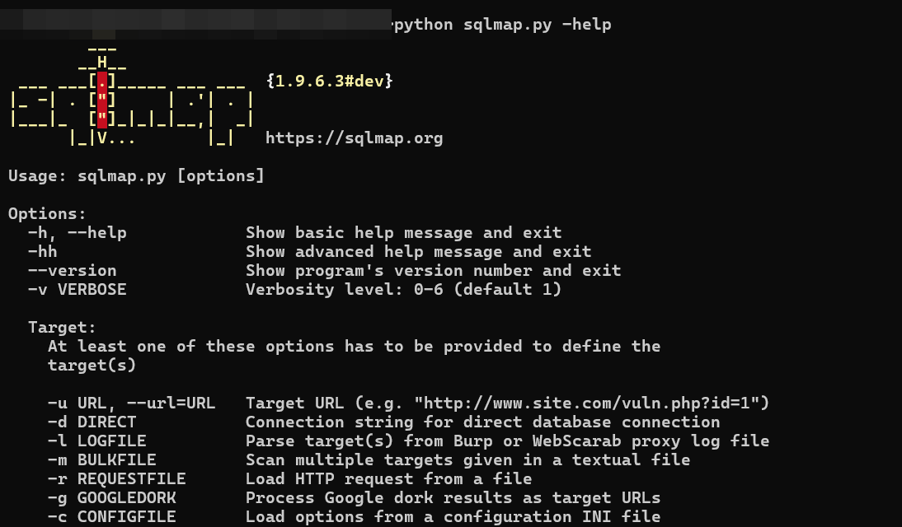
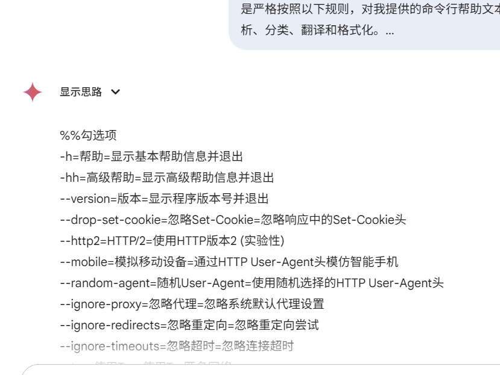
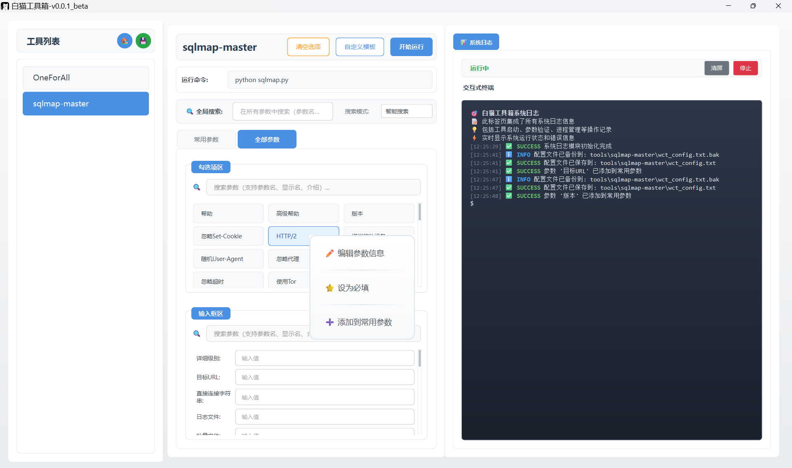

# 白猫工具箱 (White Cat Toolbox)

## 📖 项目简介

白猫工具箱是一个基于 PySide6 开发的命令行（CLI）工具集成平台。该项目旨在为所有命令行（CLI）工具提供一个统一、美观、易用的图形化工具管理界面，**因此不会提供任何付费版本，只接受赞助商和开源赞助**。

## ✨ 主要特性

### 🎯 核心功能
- **统一的图形化界面** - 基于 PySide6 构建的现代化 GUI
- **多工具集成** - 支持集成命令行（CLI）工具
- **参数配置管理** - 可视化的参数配置和管理系统
- **模板系统** - 支持参数模板的保存、导入和导出
- **实时终端** - 内置终端模拟器，实时显示工具输出
- **配置备份** - 一键备份和恢复所有配置文件

### 🛠️ 已集成工具
- 更多工具持续集成中...

### 🎨 界面特色
- **现代化设计** - 采用现代化 UI 设计语言
- **响应式布局** - 自适应不同屏幕尺寸
- **参数搜索** - 支持智能搜索、精确匹配和正则表达式搜索
- **拖拽操作** - 支持参数拖拽重新排序和分组
- **实时验证** - 参数输入实时必填验证和提示

## 🚀 安装和使用

### 快速开始

#### 源码运行

1. **克隆项目**
   
   ```bash
   git clone https://github.com/honmashironeko/WhiteCatToolbox.git
   cd WhiteCatToolbox
   ```
   
2. **安装依赖**
   
   ```bash
   pip install PySide6
   ```
   
3. **运行程序**
   ```bash
   python wct.py
   ```

#### 打包运行

暂定

### 工具配置

#### 添加新工具
1. 在 `tools/` 目录下放置新工具文件夹
2. 在工具文件夹中创建 `wct_config.txt` 配置文件
3. 重启程序，新工具将自动出现在工具列表中

#### 配置文件格式
工具配置文件采用自定义格式，支持参数分组和详细描述：

```
%常用参数
%%勾选项
-o=所有优化=开启所有优化开关=0
--verbose=详细输出=显示详细信息=0

%%输入项
-u=目标URL=目标URL地址=0
-t=线程数=并发线程数量=0

%全部参数
%%勾选项
...更多参数
```

## 📚 功能详解

### 1. 工具管理
- 自动扫描 `tools/` 目录下的工具
- 支持工具终端的启动、停止和重启
- 实时显示工具运行状态和输出

### 2. 参数配置
- **可视化配置**: 通过图形界面配置工具参数
- **参数分组**: 支持常用参数和全部参数分组显示
- **智能搜索**: 支持参数名称、描述的快速搜索
- **参数验证**: 实时验证参数有效性
- **拖拽排序**: 支持参数拖拽重新排序

### 3. 模板系统
- **保存模板**: 将当前参数配置保存为模板
- **应用模板**: 快速应用已保存的参数配置
- **模板管理**: 编辑、删除、导入、导出模板
- **模板分享**: 支持模板文件的导入导出

### 4. 配置备份
- **一键备份**: 备份所有配置文件、模板和历史记录
- **快速恢复**: 从备份文件恢复配置
- **版本管理**: 支持多个备份版本的管理

## 📁 项目结构

```
WhiteCatToolbox/
├── wct.py                     # 主程序文件
├── favicon.ico                # 程序图标
├── command_history.json       # 命令历史记录
├── promotion_config.json      # 推广配置文件
├── prompt.txt				   # 提示词文件
├── templates/                 # 模板文件目录
├── tools/                     # 工具目录
└── promotion/                 # 推广文件目录
    ├── gg.txt                 # 推广信息
    ├── xm.txt                 # 项目信息
    └── zz.txt                 # 赞助信息
```

## ⚙️ 配置说明

### 工具配置文件 (wct_config.txt)
每个工具的配置文件定义了工具的参数结构和默认值。配置文件格式说明：

- %常用参数 %全部参数 - 两种参数标签页

- %%勾选项 %%输入项 - 两种参数分区

- 参数=显示参数=参数介绍=是否必填（1是必填，不填写默认为0） - -u=目标URL=目标URL=1

  ```
  %常用参数 
  %%勾选项 
  -h=帮助=显示基本帮助信息并退出=0
  %%输入项
  -u=目标URL=目标URL=1
  
  %全部参数
  %%勾选项 
  -h=帮助=显示基本帮助信息并退出=0
  %%输入项
  -u=目标URL=目标URL=1
  ```

### AI生成配置文件

本项目提供了快速生成配置文件的AI提示词，方便您生成初步的配置文件：

- 获取工具帮助：通过执行--help、查看帮助文档等方法，获取完整参数帮助。
- 拼接提示词并生成初版配置：将 prompt.txt 中的[将此处替换为工具的help]替换为获取的完整参数帮助，发发送给AI并得到初步配置。
- 创建配置文件：到对应工具文件夹下创建 wct_config.txt，将初步配置粘贴进去，按上述配置文件格式添加文件识别开头，启动 WhiteCatToolbox。
- 完成配置：通过右键菜单、拖拽控件的方式，将参数添加到常用参数、区分勾选项和输入项，并增加必填项。

示例图：








## 🔧 高级功能

### 参数类型转换
支持在不同参数分组间拖拽参数，自动进行类型转换和适配。

### 批量操作
支持批量编辑参数、批量应用模板等操作。

## 🐛 故障排除

### 常见问题

1. **程序无法启动**
   - 检查 Python 版本是否为 3.8+
   - 确认已安装 PySide6 依赖库
   - 检查是否有权限访问程序目录

2. **工具无法识别**
   - 确认工具目录下存在 `wct_config.txt` 文件
   - 检查配置文件格式是否正确
   - 重启程序重新扫描工具

3. **参数配置丢失**
   - 检查 `templates/` 目录是否存在
   - 尝试从备份文件恢复配置
   - 重新创建参数配置

### 日志和调试
程序运行时会在终端显示详细的调试信息，如遇问题可查看控制台输出。

## 🤝 贡献指南

我们欢迎各种形式的贡献，包括但不限于：

- 🐛 报告 Bug
- 💡 提出新功能建议
- 📝 改进文档
- 🔧 提交代码修复
- 🎨 UI 改进
- 📁 工具配置文件

## 📄 许可证

本项目采用 GNU General Public License v2.0 许可证。

## 📞 支持与反馈

如果您在使用过程中遇到问题或有任何建议，请通过以下方式联系我们：

- 🐛 [Issues](https://github.com/your-repo/白猫工具箱/issues) - 报告问题

## 📝 开发计划

- 检查项目版本更新
- 支持 UI 主题自定义导入
- 支持中英双语

## 📝 更新日志

## 🌟 致谢

感谢所有为本项目做出贡献的开发者和用户，特别感谢：

- Qt 和 PySide6 开发团队

## 🌟开源赞助

赞助商名单：

- N/A

打赏名单：

|                             排名                             |                   ID                   | 赞助金额（元） |
| :----------------------------------------------------------: | :------------------------------------: | :------------: |
|                              1                               |                **陆沉**                |    1518.06     |
|                              2                               |             **乡村牛公子**             |      976       |
|                              3                               |          **柯林斯.民间新秀**           |      696       |
| [赞助榜单](https://github.com/honmashironeko/Thanks-for-sponsorship) | 您的每一份赞助都是作者源源不断的动力！ |    (´∀｀)♡     |

**⭐ 如果这个项目对您有帮助，请给它一个星标！** 